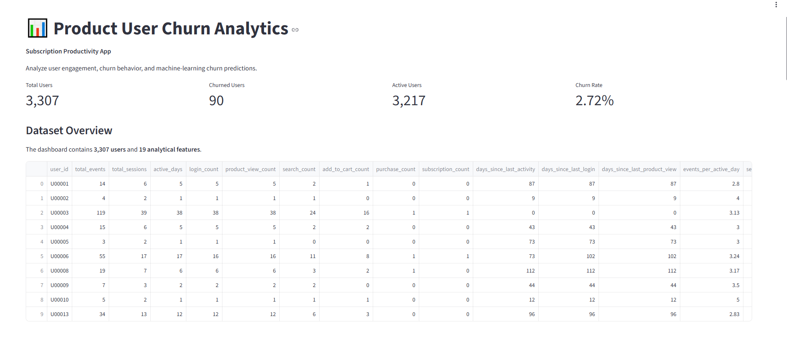

# Product User Churn Prediction & Analytics

End-to-end Product Analytics and Churn Prediction project using **Python, SQL, ETL, Machine Learning, and Streamlit**.

🌐 **[Project Website](https://nagarajwadi.github.io/product-churn-analytics/)** · 📊 **[Live Interactive Dashboard](https://churn-analytics-nagaraj.streamlit.app)** · 💻 **[GitHub Repository](https://github.com/Nagarajwadi/product-churn-analytics)**




## 📌 Project Overview

This project analyzes user behavior for a fictional subscription-based productivity application and builds a machine-learning pipeline to identify users at risk of churn.

The project demonstrates how product event data can be transformed into analytical features, evaluated using SQL and Python, and used to support churn-risk analysis through an interactive dashboard.

## 🎯 Business Problem

Subscription products need to understand which users may be at risk of leaving so product and customer-success teams can investigate user behavior and evaluate possible retention strategies.

This project answers questions such as:

- Which users are showing higher predicted churn risk?
- How does user engagement differ between churned and non-churned users?
- Which behavioral features contribute most to model predictions?
- How does changing the prediction threshold affect users targeted, recall, and false positives?
- What behavioral information is available for an individual high-risk user?

## 🏗️ Project Architecture

```text
Synthetic Product Events
        ↓
ETL Cleaning & Validation
        ↓
SQLite Database
        ↓
SQL Product Metrics
        ↓
Churn Feature Dataset
        ↓
Machine Learning
        ↓
Churn Risk Score
        ↓
Risk Segmentation
        ↓
Interactive Streamlit Dashboard```

## Technologies

- **Python** — data generation, ETL, feature engineering, machine learning
- **Pandas / NumPy** — data processing and analysis
- **SQL / SQLite** — analytical queries and feature dataset creation
- **Scikit-learn** — Logistic Regression and Random Forest
- **Streamlit** — interactive analytics dashboard
- **Matplotlib / Seaborn** — visualization
- **Git / GitHub** — version control and project collaboration
- **Jupyter Notebook** — exploratory analysis


## Project Structure

- `dashboard/` — Streamlit dashboard
- `data/raw/` — generated raw event data
- `data/processed/` — cleaned data, ML dataset, predictions and model results
- `etl/` — ETL pipeline
- `sql/` — SQLite setup, analytics queries and ML dataset creation
- `src/` — data generation and machine learning scripts
- `notebooks/` — exploratory analysis
- `requirements.txt` — Python dependencies

## Data & ETL Pipeline

The project uses synthetic product event data representing a subscription-based productivity application.

The pipeline follows these stages:

1. **Generate** — create realistic user-level product events for 5,000 users.
2. **Extract** — read the raw event CSV using Pandas.
3. **Transform** — parse timestamps, remove duplicates, validate event types and clean the event data.
4. **Load** — store the cleaned events in SQLite for analytical querying.
5. **Feature Engineering** — create user-level behavioral and recency features for churn analysis and machine learning.
6. **Modeling** — train and evaluate churn prediction models using the engineered dataset.

The churn dataset uses a time-based design: user behavior from January-April 2026 is used to predict churn observed during May-June 2026.

## Product Analytics & Feature Engineering

User-level product metrics were created from the cleaned event data to capture engagement, activity and purchasing behavior.

Key features include:

- Total events and sessions
- Active days
- Login, product-view, search and add-to-cart counts
- Purchase and subscription counts
- Days since last activity
- Days since last login
- Days since last product view
- Events and sessions per active day
- Search, cart and purchase rates

These features connect raw product usage behavior with measurable churn outcomes and provide an interpretable foundation for machine learning.

## Machine Learning

Two classification models were evaluated for predicting user churn:

- **Logistic Regression** — provides an interpretable baseline and feature coefficients.
- **Random Forest** — captures nonlinear relationships between product behavior and churn risk.

Because churn is relatively rare in the dataset, model performance is evaluated using **ROC-AUC** and **PR-AUC**, rather than relying on accuracy alone.

The final Random Forest model produces a churn risk score for each user in the held-out test set. These scores are used to create Low, Medium and High risk segments for the dashboard. Because the raw Random Forest outputs are not calibrated probabilities, the dashboard presents them as risk scores rather than literal probabilities.

## Model Evaluation

The models were evaluated on a stratified held-out test set.

| Model | ROC-AUC | PR-AUC |
|---|---:|---:|
| Logistic Regression | 0.931 | 0.168 |
| Random Forest | **0.953** | **0.402** |

### Cross-Validation Stability

A 5-fold stratified cross-validation experiment was performed as a robustness check using the same Random Forest configuration.

| Metric | Mean | Std. Dev. |
|---|---:|---:|
| ROC-AUC | 0.919 | 0.013 |
| PR-AUC | 0.244 | 0.054 |

ROC-AUC showed relatively low variation across folds, while PR-AUC showed greater variation. The cross-validation results provide a more conservative view of model performance than relying only on the single 80/20 holdout split.

### Permutation Importance

Permutation importance was evaluated on the held-out test set using PR-AUC as the scoring metric. The results provide an additional view of which features contribute to predictive performance.

The strongest permutation signal came from `subscription_count`, followed by activity recency features such as `days_since_last_login`, `days_since_last_product_view`, and `days_since_last_activity`.

These results broadly support the Random Forest's built-in feature importance analysis. However, `subscription_count` requires caution because the synthetic churn definition requires a prior subscription before a cancellation event can occur.

Permutation importance measures the effect of disrupting a feature on model performance. It does not indicate the direction of the relationship and does not establish causality.

The Random Forest achieved a ROC-AUC of **0.953** and PR-AUC of **0.402** on the held-out synthetic test set. PR-AUC is particularly relevant because the churn class is highly imbalanced.

The model is used as a ranking and risk-estimation tool rather than as a definitive classification of whether an individual user will churn.

## Threshold Analysis & Business Interpretation

Different risk-score thresholds produce different trade-offs between identifying churners and the number of users targeted for intervention.

| Threshold | Users Targeted | Churners Identified | False Positives | Precision | Recall |
|---:|---:|---:|---:|---:|---:|
| 0.20 | 137 | 17 | 120 | 0.124 | 0.944 |
| 0.30 | 129 | 17 | 112 | 0.132 | 0.944 |
| 0.40 | 119 | 16 | 103 | 0.134 | 0.889 |
| 0.50 | 113 | 16 | 97 | 0.142 | 0.889 |
| 0.60 | 99 | 16 | 83 | 0.162 | 0.889 |

A lower threshold identifies more potential churners but also increases the number of false positives. A higher threshold reduces the number of users targeted while identifying a smaller set of high-risk cases.

The appropriate operating threshold depends on the business cost of customer-retention interventions and the relative cost of missing a potential churner. The project therefore presents threshold analysis rather than declaring a universally optimal threshold.

## Streamlit Dashboard

The project includes an interactive Streamlit dashboard that connects product analytics with machine learning outputs.

Dashboard components include:

- Overall user and churn KPIs
- Churn distribution
- Average engagement by churn status
- Random Forest feature importance
- Churn-risk distribution across held-out test users
- Adjustable risk-score threshold analysis
- Individual user behavioral context
- Individual user churn-risk score and risk segment
- Filterable user churn-risk table
- Product-level insights based on observed user behavior and model signals

The dashboard is designed to demonstrate how analytical results can be translated into a product-facing decision-support interface.

## Product Insights & Findings

The analysis surfaces several product-level signals associated with churn risk:

- Churn risk is strongly associated with **subscription history and activity recency** in the Random Forest model.
- Users with different levels of product engagement show different observed churn behavior.
- **Days since last activity, last login and last product view** provide useful recency signals for churn prediction.
- The dashboard makes it possible to move from aggregate product metrics to an individual user risk profile.
- Threshold analysis demonstrates the operational trade-off between reaching more users and increasing false positives.

These findings represent observed patterns in the synthetic dataset and model signals. They should not be interpreted as causal relationships.

## 📚 Project Case Study

A detailed recruiter-facing case study is available here:

**[Product Results & Analysis](docs/project-results.md)**

The case study covers:

- Business problem
- Data and ETL pipeline
- Churn definition and feature engineering
- Exploratory analysis
- Model evaluation
- Threshold analysis
- Feature importance
- Product insights
- Dashboard
- Limitations

## Limitations

- The dataset is synthetic and does not represent real customer behavior.
- The churn rate is relatively low, creating class imbalance and making precision-recall trade-offs important.
- The current feature set is based on event-level product behavior and does not include customer-support interactions, pricing changes, marketing campaigns or qualitative feedback.
- Subscription history is structurally related to churn eligibility because only subscribed users can generate cancellation events. Its high model importance should therefore be interpreted carefully.
- Model performance is based on a single time-based outcome period and may change on new data.
- Predictions should support product investigation and retention workflows rather than be treated as causal explanations.

## How to Run

Clone the repository and install the required dependencies:

```bash
pip install -r requirements.txt
```

Generate the synthetic product event data:

```bash
python src/generate_data.py
```

Run the ETL pipeline:

```bash
python etl/etl_pipeline.py
```

Create the SQLite database and load the cleaned events:

```bash
python sql/setup_database.py
```

Run the product analytics queries:

```bash
python sql/run_query.py
```

Create the machine-learning dataset:

```bash
python sql/create_ml_dataset.py
```

Train and evaluate the churn prediction models:

```bash
python src/train_model.py
```

Launch the Streamlit dashboard:

```bash
streamlit run dashboard/app.py
```

## API Integration

The project also demonstrates an external REST API ingestion and enrichment workflow using the DummyJSON Users API.

The API integration includes:

- Reusable Python API client using `requests`
- HTTP response validation and timeout handling
- Paginated API ingestion
- Explicit field selection to exclude unnecessary sensitive fields
- JSON ingestion layer
- Loading API data into SQLite
- Joining API attributes with synthetic product-event data
- API-enriched SQL analysis
- Automated tests for API transformation logic

### API Pipeline

```text
DummyJSON REST API
        ↓
Python API Client
        ↓
Pagination + Response Validation
        ↓
Field Transformation
        ↓
JSON Ingestion
        ↓
SQLite api_users
        ↓
user_api_enrichment
        ↓
API-enriched SQL Analysis
```

The API data is synthetic/demo data and is used to demonstrate API integration and data-enrichment techniques. It is not treated as real customer data and is not used as a causal explanation of churn.

### API Integration Commands

Fetch and validate the API data:

```bash
python -m etl.api_ingestion
```

Load the API data into SQLite:

```bash
python -m sql.load_api_users
```

Create the user-level enrichment table:

```bash
python -m sql.create_api_enrichment
```

Run the API-enriched analysis:

```bash
sqlite3 data/product_analytics.db < sql/api_enrichment_analysis.sql
```
